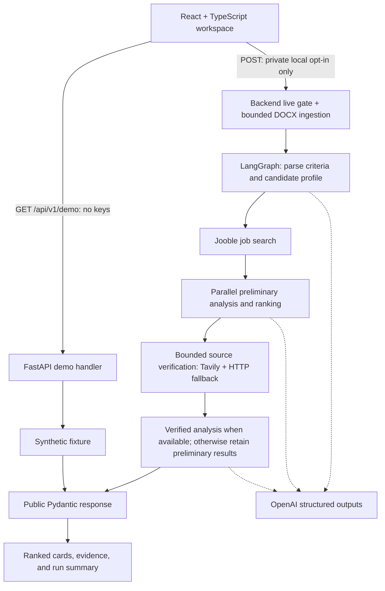

# AI Job Search Agent

An evidence-aware job-search assistant that helps engineers turn a resume and a
natural-language request into a shortlist worth reviewing. It makes strengths,
skill gaps, source verification, and uncertainty visible instead of returning
an unexplained match score.

**Decision support only: this tool never submits applications.** The public-facing
experience is a synthetic demo, not a feed of current openings or a hiring prediction.
Live provider-backed analysis is available only when explicitly enabled for private
local use. No Azure deployment exists yet.

## Features and engineering focus

- **Explainable ranking:** company, role, location, recommendation, confidence,
  strengths, missing skills, and source links in an accessible React workspace.
- **Evidence-aware verification:** preliminary scores remain distinct from scores
  produced after source verification; failed verification preserves useful results.
- **Reliable orchestration:** LangGraph fan-out/aggregation with explicit empty-result
  paths, defensive job-date parsing, and direct HTTP/JSON-LD extraction fallback.
- **Bounded DOCX ingestion:** paragraph and table extraction, archive expansion limits,
  and cleanup of temporary uploads without a permanently saved resume.
- **Safe demonstration:** a key-free sample endpoint, synthetic data, and independent
  frontend/backend switches that default live access off.
- **Testable boundaries:** explicit public Pydantic models, mocked provider calls,
  offline tests, and CI for backend tests plus frontend tests, lint, and build.

The intended value is less manual triage and a clearer basis for deciding which roles
to investigate. Time savings and match quality have not been measured in a production
study; confidence labels are model judgments, not calibrated probabilities.

## Architecture

The HTTP layer adapts the existing graph; it does not reimplement matching logic.
The demo reads the same public response shape from an invented fixture and bypasses
the graph and providers entirely.



Empty job lists, no verification candidates, and no successfully verified jobs still
reach finalization. Per-job analysis results are aggregated through graph reducers.
The live API waits for the synchronous workflow in a worker thread; there is no queue,
streaming, persistent job store, or automatic retry in the UI.

| Layer | Technology / location |
| --- | --- |
| Interface | React, TypeScript, Vite; `frontend/src/` |
| HTTP contract and validation | FastAPI, Pydantic; `app/api.py`, `app/api_models.py`, `app/api_service.py` |
| Orchestration and matching | LangGraph, LangChain/OpenAI structured outputs; `app/graph.py`, `app/nodes.py` |
| Ingestion and retrieval | python-docx, requests, Beautiful Soup, Jooble, Tavily; `app/uploads.py`, `app/tools/` |
| Offline quality checks | pytest, Vitest, Testing Library, ESLint, TypeScript; `tests/`, `frontend/src/test/` |
| Continuous integration | GitHub Actions; `.github/workflows/ci.yml` |

### Reading match scores

- **Preliminary Match Score:** based on the initial job information. It is useful for
  triage but must not be presented as verified.
- **Verified Match Score:** numeric only when `verification_status=verified` and the
  analysis is verified. Source verification is not a guarantee that an opening is
  current, accurate, or suitable.
- **Missing, empty, or unknown statuses:** unverified; never upgrade them implicitly.
- **`not_needed`:** a complete description was available, so source verification was
  skipped. Its score remains preliminary.
- **Failed/not-found verification:** preserve preliminary evidence and clearly label
  the limitation. Partial runs can still return useful jobs.

All companies, candidate details, scores, and verification outcomes in
`app/fixtures/demo.json` are synthetic. Its `example.com` links are placeholders,
not real postings.

## Safe local demo — no resume or provider keys needed

Requirements: Python 3.11+ and Node.js 22.12+ with npm. CI uses Python 3.11 and Node 22.
Commands below use PowerShell; on macOS/Linux use `.venv/bin/python` and shell
`export NAME=value` syntax instead.

From the repository root, in terminal 1:

```powershell
python -m venv .venv
.venv\Scripts\python.exe -m pip install -e ".[dev]"
$env:ENABLE_LIVE_SEARCH="false"
$env:CORS_ORIGINS="http://localhost:5173"
.venv\Scripts\python.exe -m uvicorn app.api:app --host 127.0.0.1 --port 8000
```

In terminal 2:

```powershell
cd frontend
npm ci
$env:VITE_API_BASE_URL="http://127.0.0.1:8000"
$env:VITE_ENABLE_LIVE_SEARCH="false"
npm run dev
```

Open `http://localhost:5173` and choose **Try Sample Demo**. Initial page load does not
search. Upload and live-submission controls remain disabled. Vite uses a strict port
so a conflict cannot silently invalidate the documented CORS origin.

```powershell
curl.exe http://127.0.0.1:8000/health
curl.exe http://127.0.0.1:8000/api/v1/demo
```

`GET /health` returns `{"status":"ok"}`; it checks the process, not provider readiness.
Neither GET route needs credentials or initializes external providers.

### Configuration

| Setting | Default | Purpose |
| --- | --- | --- |
| `VITE_API_BASE_URL` | `http://127.0.0.1:8000` | Public API origin, without trailing slash |
| `VITE_ENABLE_LIVE_SEARCH` | `false` | Only exact `true` enables live UI controls |
| `ENABLE_LIVE_SEARCH` | `false` | Backend opt-in, read when the app is created |
| `CORS_ORIGINS` | empty | Explicit allowed origins, e.g. `http://localhost:5173`; no wildcard or credentialed CORS |
| `MAX_VERIFICATION_JOBS` | `2` | Server-level verification limit; non-negative integer |
| `TAVILY_MAX_RESULTS` | `5` | Server-level search limit, 1–20 |

`frontend/.env.example` contains public defaults only. Optional frontend overrides
belong in ignored `frontend/.env.local`; restart Vite after changing them.
**Every `VITE_*` value is public build-time configuration—never place keys there.**
Rebuild production assets to change those values. CORS and UI switches are not access
control; the backend gate is independent and rejects disabled POST requests before
reading uploads.

## Private local live setup — optional and potentially billable

Do not use this path for a public demo.

1. Supply `OPENAI_API_KEY`, `JOOBLE_API_KEY`, and `TAVILY_API_KEY` to the **backend
   process only**, using your local secret manager or an ignored root `.env`.
   Never paste real key values into this README, source files, frontend variables,
   screenshots, logs, or GitHub Actions. Tavily is optional if
   `MAX_VERIFICATION_JOBS=0`.
2. In terminal 1, set `$env:ENABLE_LIVE_SEARCH="true"`, retain the explicit local
   CORS origin, and restart uvicorn. If using an ignored root `.env`, explicitly add
   `--env-file .env` to the local startup command; imports do not load it automatically.
3. In terminal 2, set `$env:VITE_ENABLE_LIVE_SEARCH="true"` and restart Vite.
4. Choose your own DOCX and run live analysis only after accepting the provider/privacy
   implications. Keep it local. Do not add the file to the repository.

A request can take several minutes. The UI shows no invented completion percentage.
Leaving the page aborts the browser request but **does not guarantee cancellation of
provider work or charges**. The CLI (`python main.py`) also remains a live/manual path:
it explicitly loads local configuration and `data/resume.docx`; it is not a demo or
CI command. Optional diagnostics are described in `scripts/manual/README.md`.

## API contract

| Route | Behavior |
| --- | --- |
| `GET /health` | Small key-free process health response |
| `GET /api/v1/demo` | Synthetic `JobSearchResponse`; no provider calls |
| `POST /api/v1/job-search` | Local opt-in only: multipart `resume` (DOCX) and `search_request` (1–2000 non-whitespace characters); disabled by default |

Only one file and one search field are accepted. Use the DOCX MIME type or
`application/octet-stream`. The API intentionally exposes no per-request result or
verification-limit overrides; the graph currently requests up to 10 jobs.

Both search responses contain `criteria`, `candidate_profile` (summary and experience,
not raw resume text), `ranked_jobs`, and `run_summary`. Jobs include separate scores,
status, confidence, strengths, missing skills, recommendation, and sanitized source
URLs. Internal graph state and raw provider exceptions are not serialized.

Empty results are HTTP 200 with empty arrays. Verification failures may produce a
`partial` summary with retained preliminary jobs. Errors use
`{"error":{"code":"...","message":"..."}}`: 400 malformed request, 403 live disabled,
413 oversized upload, 415 wrong type, 422 invalid form/unreadable DOCX, 502 provider
failure, 503 provider configuration missing/invalid, and 500 unexpected failure.
Local interactive docs are at `/docs` and `/openapi.json`; they include the live route
schema even while the gate is off.

## Tests and CI

From the repository root:

```powershell
.venv\Scripts\python.exe -m pytest -q
.venv\Scripts\python.exe -m pip check
git diff --check
cd frontend
npm ci
npm test
npm run lint
npm run build
npm ls --all
npm audit
```

Backend tests block external socket connections, mock workflow/provider boundaries,
generate DOCX content in memory, and include credential-free import checks. Frontend
tests replace fetch with mocks. They cover empty/failure paths, date parsing,
extraction fallback, score semantics, bounded uploads, demo behavior, errors, and
accessibility-focused interactions. Manual scripts are outside pytest collection.

The CI workflow runs on pushes, pull requests, and manual dispatch. It installs
backend dependencies and locked frontend dependencies, then runs the complete suites,
dependency-integrity checks, lint, and the demo-safe production build. It has read-only
repository permissions, disables credential persistence, supplies no provider secrets,
disables dotenv loading, and rejects tracked private environment/resume/data files.
Tests may exercise mocked live branches; no real live service is enabled or called.
Package installation and optional `npm audit` use package registries/advisory services;
“offline” describes the application tests, not dependency downloads.

CI does **not** deploy, publish artifacts, provision Azure resources, or run the CLI.
Its first hosted result will only be available after a separately authorized push.
The frontend lockfile is reproducible with `npm ci`; backend dependencies currently
use version ranges, not a fully pinned transitive lock.

## Security and privacy limitations

- DOCX uploads are limited to **5 MiB**, whole multipart requests to **5 MiB + 64 KiB**,
  and expanded archives to **20 MiB / 1000 entries**. Duplicate/encrypted members and
  invalid archives are rejected. Body paragraphs and tables are extracted in order
  without duplicate merged cells; headers, footers, and scanned images are excluded.
- No permanent resume file is saved. Multipart resources are closed on success/failure;
  bounded archive normalization and parsing happen in memory. In the browser, the file
  remains in memory only and is cleared after a live request. No upload/result is
  written to browser storage or application analytics.
- Live requests send resume-derived information to external providers. Provider
  retention policies and any independently enabled tracing are outside this app's
  guarantees. Returned candidate summaries may contain personal information.
- There is no authentication, rate limiting, per-user quota, background cancellation,
  database, or production access-control layer. Do not expose the live service publicly.
- Job pages and model output are untrusted. Verification is fallible; this is not a
  fully hardened arbitrary-URL retrieval sandbox or a defense against all prompt
  injection. Review original postings before deciding to apply.
- Public demo mode must carry no provider secrets and expose only synthetic data.
  A disabled button or CORS configuration cannot protect a paid endpoint on its own.

## Azure deployment recommendation — design only

**Recommended:** Azure Static Web Apps for the Vite assets, plus a separate
**demo-only** FastAPI application on Linux Azure App Service. This retains a real
HTTP/schema boundary for the portfolio while keeping the graph and paid providers
out of the public request path. Static Web Apps hosts React assets; App Service
supports Python/FastAPI. See the official [Static Web Apps overview](https://learn.microsoft.com/en-us/azure/static-web-apps/overview)
and [Python App Service guidance](https://learn.microsoft.com/en-us/azure/app-service/quickstart-python).

Proposed topology: visitor → Static Web Apps (`frontend/dist`) → HTTPS GET to
demo-only App Service → packaged synthetic fixture. Use the App Service HTTPS origin
as `VITE_API_BASE_URL`, `VITE_ENABLE_LIVE_SEARCH=false` at build time, and allow only
the exact deployed frontend origin in backend CORS. This proposal uses separate
origins; it does not assume a linked backend or a wildcard.

Before any public deployment, a later implementation must:

1. Create a separate ASGI entrypoint exposing only `GET /health` and `GET /api/v1/demo`
   (plus required CORS preflight), with no upload/live route or live OpenAPI schema.
   Reuse the public response model and synthetic fixture without importing the graph
   or constructing provider clients. **Do not deploy the current `app.api:app`
   unchanged:** it still registers the live route even when POST is denied.
2. Include only the demo handler/model/fixture in the backend release, omit provider
   credentials and live-workflow modules, and verify that direct calls to the backend's
   upload path cannot invoke or ingest a resume. Keep `ENABLE_LIVE_SEARCH=false` as
   defense in depth, not the only boundary.
3. Produce a narrowly scoped backend package and an explicit ASGI startup command for
   the chosen supported Python runtime. The current editable `pyproject.toml` install
   and local `app.api:app` command are not an Azure release pipeline. Do not assume
   framework auto-detection will find the future demo-only entrypoint.
4. Verify HTTPS, exact-origin CORS, key-free startup, synthetic-only responses, absent
   live routes, upload rejection, and safe logs before release. Review resource tiers,
   regional availability, hosting costs, and budget alerts before provisioning.
5. Add a separately approved deployment workflow with appropriately scoped Azure
   identity. The validation workflow added here deliberately has no deploy permissions.

### Alternatives considered

| Option | Trade-off |
| --- | --- |
| Static Web Apps + demo-only App Service (recommended) | Preserves the Python API boundary with managed hosting; requires a demo-only release and a hosting budget |
| Static Web Apps only, serving synthetic JSON | Fewer moving parts and no backend/provider path; requires a future static-demo adapter because the UI currently calls `/api/v1/demo` |
| Static Web Apps linked to App Service | Same-origin API integration, but introduces plan/integration constraints; unnecessary for the first sample release |
| Container Apps | Useful if containerization becomes a requirement; adds packaging work not needed for this stage |

Azure's linked “bring your own API” feature requires the Static Web Apps Standard
plan; integrated APIs also have a 45-second request limit. Those limits are another
reason not to put the existing several-minute live workflow behind a public demo
API. See [Azure API options and constraints](https://learn.microsoft.com/en-us/azure/static-web-apps/apis-overview).
The separate-origin recommendation above does not use that integrated proxy.

No Azure resources, deployment manifests, Docker configuration, or cloud credentials
are created in Stage 4A. Public deployment remains blocked until the demo-only release
boundary and the pre-deployment checks above are implemented and approved.
