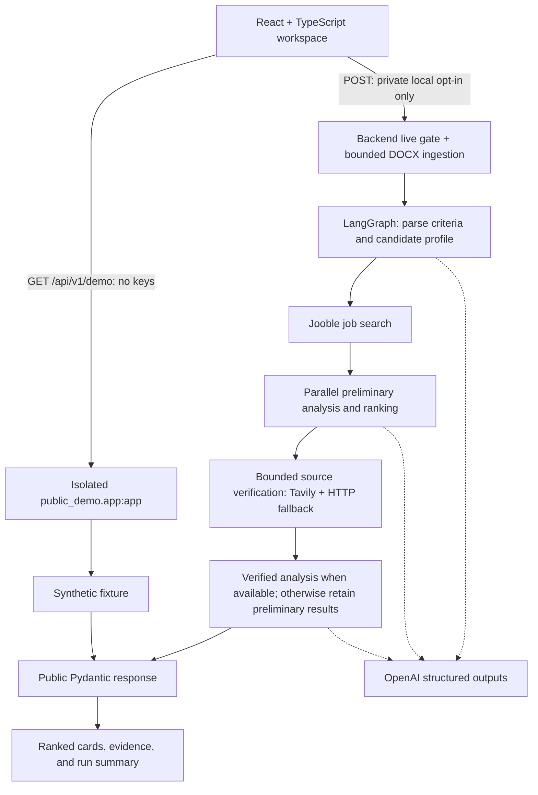

# AI Job Search Agent

An evidence-aware job-search assistant that helps engineers turn a resume and a
natural-language request into a shortlist worth reviewing. It makes strengths,
skill gaps, source verification, and uncertainty visible instead of returning
an unexplained match score.

**Decision support only: this tool never submits applications.** The public-facing
experience is a synthetic demo, not a feed of current openings or a hiring prediction.
Live provider-backed analysis is available only when explicitly enabled for private
local use. No Azure deployment exists yet.

## Features and engineering focus

- **Explainable ranking:** company, role, location, recommendation, confidence,
  strengths, missing skills, and source links in an accessible React workspace.
- **Evidence-aware verification:** preliminary scores remain distinct from scores
  produced after source verification; failed verification preserves useful results.
- **Reliable orchestration:** LangGraph fan-out/aggregation with explicit empty-result
  paths, defensive job-date parsing, and direct HTTP/JSON-LD extraction fallback.
- **Bounded DOCX ingestion:** paragraph and table extraction, archive expansion limits,
  and cleanup of temporary uploads without a permanently saved resume.
- **Safe demonstration:** a key-free sample endpoint, synthetic data, and independent
  frontend/backend switches that default live access off.
- **Testable boundaries:** explicit public Pydantic models, mocked provider calls,
  offline tests, and CI for backend tests plus frontend tests, lint, and build.

The intended value is less manual triage and a clearer basis for deciding which roles
to investigate. Time savings and match quality have not been measured in a production
study; confidence labels are model judgments, not calibrated probabilities.

## Architecture

The HTTP layer adapts the existing graph; it does not reimplement matching logic.
The demo reads the same public response shape from an invented fixture and bypasses
the graph and providers entirely.



Empty job lists, no verification candidates, and no successfully verified jobs still
reach finalization. Per-job analysis results are aggregated through graph reducers.
The live API waits for the synchronous workflow in a worker thread; there is no queue,
streaming, persistent job store, or automatic retry in the UI.

| Layer | Technology / location |
| --- | --- |
| Interface | React, TypeScript, Vite; `frontend/src/` |
| HTTP contract and validation | FastAPI, Pydantic; `app/api.py`, `app/api_models.py`, `app/api_service.py` |
| Isolated public service | FastAPI; `public_demo/app.py` (no live imports or upload routes) |
| Orchestration and matching | LangGraph, LangChain/OpenAI structured outputs; `app/graph.py`, `app/nodes.py` |
| Ingestion and retrieval | python-docx, requests, Beautiful Soup, Jooble, Tavily; `app/uploads.py`, `app/tools/` |
| Offline quality checks | pytest, Vitest, Testing Library, ESLint, TypeScript; `tests/`, `frontend/src/test/` |
| Continuous integration | GitHub Actions; `.github/workflows/ci.yml` |

### Reading match scores

Recommendations are evidence-gated: only explicitly verified results with verified
analysis and an internal `Apply`/`Strong Apply` recommendation display **Apply**.
All preliminary, missing/unknown, failed, not-found, not-attempted, and `not_needed`
statuses display **Review original posting**, regardless of model wording. Verified
`Maybe`/`Skip` recommendations remain unchanged; unsupported wording also falls back
to review. This is decision support, never automatic application submission.

- **Preliminary Match Score:** based on the initial job information. It is useful for
  triage but must not be presented as verified.
- **Verified Match Score:** numeric only when `verification_status=verified` and the
  analysis is verified. Source verification is not a guarantee that an opening is
  current, accurate, or suitable.
- **Missing, empty, or unknown statuses:** unverified; never upgrade them implicitly.
- **`not_needed`:** a complete description was available, so source verification was
  skipped. Its score remains preliminary.
- **Failed/not-found verification:** preserve preliminary evidence and clearly label
  the limitation. Partial runs can still return useful jobs.

All companies, candidate details, scores, and verification outcomes in
`app/fixtures/demo.json` are synthetic. Its `example.com` links are placeholders,
not real postings.

## Safe local demo — no resume or provider keys needed

Requirements: Python 3.11+ and Node.js 22.12+ with npm. CI uses Python 3.11 and Node 22.
Commands below use PowerShell; on macOS/Linux use `.venv/bin/python` and shell
`export NAME=value` syntax instead.

From the repository root, in terminal 1:

```powershell
python -m venv .venv
.venv\Scripts\python.exe -m pip install -e ".[dev]"
$env:ENABLE_LIVE_SEARCH="false"
$env:CORS_ORIGINS="http://localhost:5173"
.venv\Scripts\python.exe -m uvicorn app.api:app --host 127.0.0.1 --port 8000
```

In terminal 2:

```powershell
cd frontend
npm ci
$env:VITE_API_BASE_URL="http://127.0.0.1:8000"
$env:VITE_ENABLE_LIVE_SEARCH="false"
npm run dev
```

Open `http://localhost:5173` and choose **Try Sample Demo**. Initial page load does not
search. Upload and live-submission controls remain disabled. Vite uses a strict port
so a conflict cannot silently invalidate the documented CORS origin.

```powershell
curl.exe http://127.0.0.1:8000/health
curl.exe http://127.0.0.1:8000/api/v1/demo
```

`GET /health` returns `{"status":"ok"}`; it checks the process, not provider readiness.
Neither GET route needs credentials or initializes external providers.

### Configuration

| Setting | Default | Purpose |
| --- | --- | --- |
| `VITE_API_BASE_URL` | `http://127.0.0.1:8000` | Public API origin, without trailing slash |
| `VITE_ENABLE_LIVE_SEARCH` | `false` | Only exact `true` enables live UI controls |
| `ENABLE_LIVE_SEARCH` | `false` | Backend opt-in, read when the app is created |
| `CORS_ORIGINS` | empty | Explicit allowed origins, e.g. `http://localhost:5173`; no wildcard or credentialed CORS |
| `MAX_VERIFICATION_JOBS` | `2` | Server-level verification limit; non-negative integer |
| `TAVILY_MAX_RESULTS` | `5` | Server-level search limit, 1–20 |
| `MAX_SEARCH_JOBS` | `10` | Jooble request and local preliminary-analysis cap, 1–10 |
| `OPENAI_MAX_RETRIES` | `2` | Retries per model call, 0–2; zero disables retries |

`frontend/.env.example` contains public defaults only. Optional frontend overrides
belong in ignored `frontend/.env.local`; restart Vite after changing them.
**Every `VITE_*` value is public build-time configuration—never place keys there.**
Rebuild production assets to change those values. CORS and UI switches are not access
control; the backend gate is independent and rejects disabled POST requests before
reading uploads.

## Private local live setup — optional and potentially billable

Do not use this path for a public demo.

1. Supply `OPENAI_API_KEY`, `JOOBLE_API_KEY`, and `TAVILY_API_KEY` to the **backend
   process only**, using your local secret manager or an ignored root `.env`.
   Never paste real key values into this README, source files, frontend variables,
   screenshots, logs, or GitHub Actions. Tavily is optional if
   `MAX_VERIFICATION_JOBS=0`.
2. In terminal 1, set `$env:ENABLE_LIVE_SEARCH="true"`, retain the explicit local
   CORS origin, and restart uvicorn. If using an ignored root `.env`, explicitly add
   `--env-file .env` to the local startup command; imports do not load it automatically.
3. In terminal 2, set `$env:VITE_ENABLE_LIVE_SEARCH="true"` and restart Vite.
4. Choose your own DOCX and run live analysis only after accepting the provider/privacy
   implications. Keep it local. Do not add the file to the repository.

A request can take several minutes. The UI shows no invented completion percentage.
Leaving the page aborts the browser request but **does not guarantee cancellation of
provider work or charges**. The CLI (`python main.py`) also remains a live/manual path:
it explicitly loads local configuration and `data/resume.docx`; it is not a demo or
CI command. Optional diagnostics are described in `scripts/manual/README.md`.

## API contract

| Route | Behavior |
| --- | --- |
| `GET /health` | Small key-free process health response |
| `GET /api/v1/demo` | Synthetic `JobSearchResponse`; no provider calls |
| `POST /api/v1/job-search` | Local opt-in only: multipart `resume` (DOCX) and `search_request` (1–2000 non-whitespace characters); disabled by default |

Only one file and one search field are accepted. Use the DOCX MIME type or
`application/octet-stream`. The API intentionally exposes no per-request result or
verification-limit overrides; the graph requests `MAX_SEARCH_JOBS` jobs (default 10).

### Controlled private test limits (Stage 4C)

The root `.env.example` documents this opt-in test configuration without credentials:

```dotenv
MAX_SEARCH_JOBS=3
MAX_VERIFICATION_JOBS=1
TAVILY_MAX_RESULTS=1
OPENAI_MAX_RETRIES=0
```

These settings do not enable live access. Keep both live switches disabled until a
test is explicitly authorized. Set limits in the backend process environment or an
ignored local configuration file; never place provider keys in frontend variables.
Restart the backend after changing settings, particularly retries: models are lazily
created and cached. Do not mutate process configuration during a run.

When absent, `MAX_SEARCH_JOBS` defaults to 10 and `OPENAI_MAX_RETRIES` to 2, preserving
prior behavior. Present values must be decimal integers in the ranges above (outer
whitespace is accepted). Empty, malformed, and out-of-range values fail closed:
the private API returns sanitized configuration error HTTP 503 before invoking the
graph; CLI graph runs reject them before the first model call. Values are not echoed.

Jooble receives `ResultOnPage=MAX_SEARCH_JOBS`. The returned list is sliced locally
**before date filtering**; there is no refill or pagination if older jobs are removed.
LangGraph also caps its parallel preliminary-analysis dispatch. Thus a provider
returning too many jobs cannot cause extra preliminary analyses in a normal run.
`MAX_VERIFICATION_JOBS` still limits eligible candidates (zero skips verification),
and `TAVILY_MAX_RESULTS` controls results requested per advanced search, not the
number of searches. Both Tavily search helpers truncate oversized responses locally
before processing any result; verification also caps comparison inputs and extraction
attempts defensively. Tavily values use the same fail-closed integer validation,
with default 5 and range 1–20. Verification settings retain their defaults/ranges.

With the controlled settings, the strict maximum is **12 logical provider calls**
per normal workflow run with unchanged process settings:
9 OpenAI calls (criteria, profile, 3 preliminary analyses, 1 source comparison,
1 description validation, 1 metadata extraction, 1 verified analysis), 1 Jooble
request, and 2 Tavily calls (search and extraction). OpenAI retries are disabled.
At most one additional direct job-page HTTP fallback call can occur, excluding
redirects. Both Jooble job and Tavily source limits are enforced locally even if
providers return oversized lists. Logical call counts do not bound redirect hops,
token usage, or dollar cost; repeat submissions start separate runs.
Prompts, model (`gpt-4o-mini`), temperature, and scoring are unchanged. Public demo
services do not import these private limit settings or gain any live capability.

Both search responses contain `criteria`, `candidate_profile` (summary and experience,
not raw resume text), `ranked_jobs`, and `run_summary`. Jobs include separate scores,
status, confidence, strengths, missing skills, recommendation, and sanitized source
URLs. Internal graph state and raw provider exceptions are not serialized.

Empty results are HTTP 200 with empty arrays. Verification failures may produce a
`partial` summary with retained preliminary jobs. Errors use
`{"error":{"code":"...","message":"..."}}`: 400 malformed request, 403 live disabled,
413 oversized upload, 415 wrong type, 422 invalid form/unreadable DOCX, 502 provider
failure, 503 provider configuration missing/invalid, and 500 unexpected failure.
Local interactive docs are at `/docs` and `/openapi.json`; they include the live route
schema even while the gate is off.

## Tests and CI

From the repository root:

```powershell
.venv\Scripts\python.exe -m pytest -q
.venv\Scripts\python.exe -m pip check
git diff --check
cd frontend
npm ci
npm test
npm run lint
npm run build
npm ls --all
npm audit
```

Backend tests block external socket connections, mock workflow/provider boundaries,
generate DOCX content in memory, and include credential-free import checks. Frontend
tests replace fetch with mocks. They cover empty/failure paths, date parsing,
extraction fallback, score semantics, bounded uploads, demo behavior, errors, and
accessibility-focused interactions. Manual scripts are outside pytest collection.

The CI workflow runs on pushes, pull requests, and manual dispatch. It installs
backend dependencies and locked frontend dependencies, then runs the complete suites,
dependency-integrity checks, lint, and the demo-safe production build. It has read-only
repository permissions, disables credential persistence, supplies no provider secrets,
disables dotenv loading, and rejects tracked private environment/resume/data files.
Tests may exercise mocked live branches; no real live service is enabled or called.
Package installation and optional `npm audit` use package registries/advisory services;
“offline” describes the application tests, not dependency downloads.

CI does **not** deploy, publish artifacts, provision Azure resources, or run the CLI.
Offline validation has successfully run on GitHub Actions; check the workflow for
the latest commit's result before merging.
The frontend lockfile is reproducible with `npm ci`; backend dependencies currently
use version ranges, not a fully pinned transitive lock.

## Security and privacy limitations

- DOCX uploads are limited to **5 MiB**, whole multipart requests to **5 MiB + 64 KiB**,
  and expanded archives to **20 MiB / 1000 entries**. Duplicate/encrypted members and
  invalid archives are rejected. Body paragraphs and tables are extracted in order
  without duplicate merged cells; headers, footers, and scanned images are excluded.
- No permanent resume file is saved. Multipart resources are closed on success/failure;
  bounded archive normalization and parsing happen in memory. In the browser, the file
  remains in memory only and is cleared after a live request. No upload/result is
  written to browser storage or application analytics.
- Live requests send resume-derived information to external providers. Provider
  retention policies and any independently enabled tracing are outside this app's
  guarantees. Returned candidate summaries may contain personal information.
- There is no authentication, rate limiting, per-user quota, background cancellation,
  database, or production access-control layer. Do not expose the live service publicly.
- Job pages and model output are untrusted. Verification is fallible; this is not a
  fully hardened arbitrary-URL retrieval sandbox or a defense against all prompt
  injection. Review original postings before deciding to apply.
- Public demo mode must carry no provider secrets and expose only synthetic data.
  A disabled button or CORS configuration cannot protect a paid endpoint on its own.

## Azure deployment recommendation — design only

**Recommended:** Azure Static Web Apps for the Vite assets, plus a separate
**demo-only** FastAPI application on Linux Azure App Service. This retains a real
HTTP/schema boundary for the portfolio while keeping the graph and paid providers
out of the public request path. Static Web Apps hosts React assets; App Service
supports Python/FastAPI. See the official [Static Web Apps overview](https://learn.microsoft.com/en-us/azure/static-web-apps/overview)
and [Python App Service guidance](https://learn.microsoft.com/en-us/azure/app-service/quickstart-python).

Proposed topology: visitor → Static Web Apps (`frontend/dist`) → HTTPS GET to
demo-only App Service → packaged synthetic fixture. Use the App Service HTTPS origin
as `VITE_API_BASE_URL`, `VITE_ENABLE_LIVE_SEARCH=false` at build time, and allow only
the exact deployed frontend origin in backend CORS. This proposal uses separate
origins; it does not assume a linked backend or a wildcard.

### Isolated demo service and local verification (Stage 4B)

`public_demo.app:app` imports only FastAPI, the standard library, and the existing
public Pydantic models. It reads one fixed, packaged synthetic fixture. It does not
import upload handlers, the graph, provider SDKs, dotenv, or private local files.
`ENABLE_LIVE_SEARCH` has no effect on this service: there is no live implementation
to enable. **Never deploy `app.api:app` or the entire repository as the public backend.**

Public business routes are `GET /health` and `GET /api/v1/demo`. The key-free
`GET /openapi.json` describes only those routes; interactive `/docs` and `/redoc`
are disabled. Unsupported POSTs return 404/405 without reading their body. CORS
allows GET only, has no allowed origins by default, never enables credentials, and
rejects wildcard or malformed origins. Fixture failures return a generic 503 envelope;
health remains a process check rather than fixture readiness.

To verify locally, stop any API already using port 8000 and run from the repository:

```powershell
$env:CORS_ORIGINS="http://localhost:5173"
.venv\Scripts\python.exe -m uvicorn public_demo.app:app --host 127.0.0.1 --port 8000 --no-access-log
# In another terminal (no resume or provider keys):
curl.exe http://127.0.0.1:8000/health
curl.exe http://127.0.0.1:8000/api/v1/demo
curl.exe -X POST http://127.0.0.1:8000/api/v1/job-search
# The empty POST must return 404.
.venv\Scripts\python.exe -m pytest tests/test_public_demo.py -q
```

Use the existing frontend with `VITE_API_BASE_URL=http://127.0.0.1:8000` and
`VITE_ENABLE_LIVE_SEARCH=false`. For a future production build, set the API base to
the approved demo backend HTTPS origin and keep live mode false before `npm run build`.
No frontend source change or provider key is needed; a mocked test covers custom
HTTPS origins. The public backend cannot execute live requests even with a tampered UI.

### Minimal release artifacts (build locally; do not deploy yet)

```powershell
.venv\Scripts\python.exe scripts/build_demo_release.py
```

This creates ignored `dist/public-demo.zip` using an explicit six-file allowlist:
`public_demo/__init__.py`, `public_demo/app.py`, `app/api_models.py`,
`app/fixtures/demo.json`, root `requirements.txt`, and root `startup.sh`.
It rejects redirected source paths and refuses to overwrite an existing archive;
use `--output dist/public-demo-next.zip` for another build. No globs, private data,
root project dependencies, frontend assets, or live-workflow modules are packaged.
Tests also extract and exercise the archive in a fresh process with forbidden-import,
private-file, and network guards.

`deploy/demo/requirements.txt` pins only FastAPI, Pydantic, and base Uvicorn as direct
dependencies (no `standard` extra, multipart, dotenv, or provider SDKs). Transitive
dependencies are not fully locked. A clean environment can install this requirements
file without installing the root project. `deploy/demo/startup.sh` becomes `startup.sh`
in the archive; its explicit production command is:

```sh
python -m uvicorn public_demo.app:app --host 0.0.0.0 --port 8000 --workers 2 --no-access-log
```

For a future approved Linux App Service deployment, select a supported Python runtime
(local validation uses 3.11), use the extracted release root as the application root,
and set the Startup Command to `sh startup.sh`. The builder normalizes that script to
LF for Linux. Enable ZIP build automation with the app setting
`SCM_DO_BUILD_DURING_DEPLOYMENT=true` so Azure installs the root requirements file;
the ZIP intentionally contains no local virtual environment. See
[Azure ZIP deployment/build guidance](https://learn.microsoft.com/en-us/azure/app-service/deploy-zip).
This is configuration guidance, not a deployment script or permission to provision.

Set only explicit HTTPS frontend origins in `CORS_ORIGINS`, use HTTPS-only hosting,
and supply **no provider credentials or dotenv files**. Uvicorn access logging is
disabled; separately review platform/request logging, retention, and tracing. The
service does not parse uploads, but the host still receives network traffic and can
incur hosting/bandwidth costs. No authentication or traffic-abuse controls are added.

Before public release, verify the artifact on the selected Linux/Azure runtime,
HTTPS, exact-origin CORS, key-free responses, absent live routes, and platform logs.
Review region/tier costs and budget alerts, then obtain deployment approval and use
a separately authorized release identity/workflow. CI still has no deploy permissions.

### Alternatives considered

| Option | Trade-off |
| --- | --- |
| Static Web Apps + demo-only App Service (recommended) | Preserves the Python API boundary with managed hosting; the isolated release is ready for platform validation and budget approval |
| Static Web Apps only, serving synthetic JSON | Fewer moving parts and no backend/provider path; requires a future static-demo adapter because the UI currently calls `/api/v1/demo` |
| Static Web Apps linked to App Service | Same-origin API integration, but introduces plan/integration constraints; unnecessary for the first sample release |
| Container Apps | Useful if containerization becomes a requirement; adds packaging work not needed for this stage |

Azure's linked “bring your own API” feature requires the Static Web Apps Standard
plan; integrated APIs also have a 45-second request limit. Those limits are another
reason not to put the existing several-minute live workflow behind a public demo
API. See [Azure API options and constraints](https://learn.microsoft.com/en-us/azure/static-web-apps/apis-overview).
The separate-origin recommendation above does not use that integrated proxy.

No Azure resources, Docker configuration, or cloud credentials have been created.
Stage 4B adds local release artifacts, not a deployed service. Platform verification,
hosting budget approval, and explicit deployment authorization remain outstanding.
